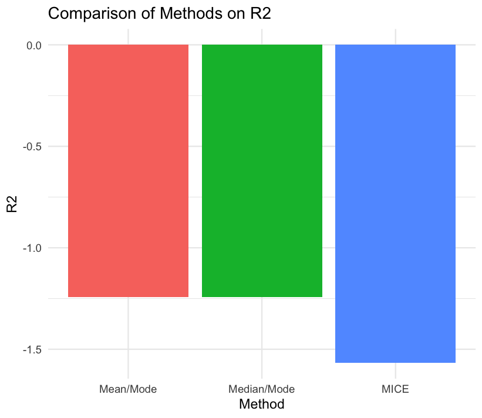
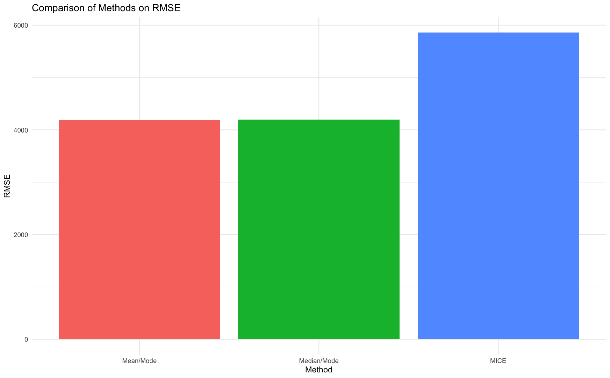
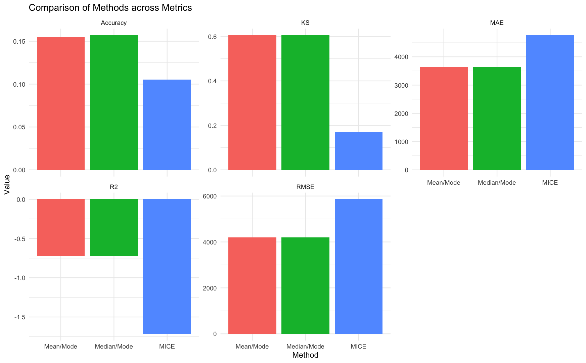

# imputetoolkit 

[](LICENSE) [](https://tanveer09.github.io/imputetoolkit/) []()

An R package for **evaluating missing data imputation methods** with a unified **R + C++ backend**. It provides a full pipeline for **data cleaning, missingness injection, imputation, and evaluation**, with support for **multiple imputation methods** and a suite of **evaluation metrics**.

Implemented with an efficient **Rcpp backend** and an intuitive **S3 interface** (`print`, `summary`, `plot`), the package is designed for **benchmarking imputation strategies** and teaching/experimentation with missing data handling.

## Package Components

### Core Structure

-   **DESCRIPTION / NAMESPACE**: Standard package metadata, dependencies, and exported functions.
-   **R/**: R interface functions, wrapper utilities, and S3 methods.
-   **src/**: C++ backend (`evaluator.cpp`, `imputer.cpp`) compiled via Rcpp.
-   **tests/testthat/**: Unit tests for R and C++ integration.
-   **vignettes/**: Demonstration of package usage and design.
-   **inst/extdata/**: Sample dataset (`sample_dataset.csv`).

### R Files

-   **api.R**
    -   Entry point functions for users.
-   **imputer.R**
    -   Implements helper routines for imputation (mean, median, mode, MICE).
    -   **evaluator()**
        -   Main pipeline: `evaluator()`\
        -   Steps:
            -   Load dataset (CSV, TSV, TXT, Excel, RDS).\
            -   Clean categorical variables, inject controlled missingness.\
            -   Apply multiple imputation strategies: **Mean/Mode**, **Median/Mode**, **MICE**.\
            -   Collect true vs. imputed values.\
            -   Pass to the **C++ backend evaluator** for metric computation.\
        -   Exports S3 methods:
            -   `print.evaluator`: concise textual summary.\
            -   `summary.evaluator`: per-column + global metrics table.\
            -   `plot_metrics`: ggplot comparison of methods.\
            -   `print_metrics`: table-formatted comparison via knitr.\
            -   `suggest_best_method`: choose method by metric (min/max).\
            -   `evaluate_results`: wrapper to print, plot, and suggest best method.
-   **RcppExports.R**
    -   Auto-generated glue between R and C++ (via Rcpp).

### C++ Files (src/)

-   **evaluator.cpp**
    -   Implements `evaluate_imputation()` (exported to R).\
    -   Defines an **Evaluator class** that computes:
        -   RMSE, MAE, R², correlation, KS statistic, Accuracy.\
        -   Per-column metrics and global averages.\
    -   Uses **OOP encapsulation** (private methods for column-level evaluation, public interface returning results).
-   **imputer.cpp** *(extension point)*
    -   Placeholder for additional algorithms (future work).
-   **RcppExports.cpp**
    -   Auto-generated bindings between R and C++.

### Testing (tests/testthat/)

-   **test-evaluator.R**
    -   Tests the full pipeline with the synthetic dataset.\
    -   Verifies all methods (`mean_mode`, `median_mode`, `mice`).\
    -   Checks:
        -   Metrics existence (`RMSE`, `MAE`, `R2`, `Correlation`, `KS`, `Accuracy`).\
        -   `print` and `summary` invisibility.\
        -   Wrapper functions (`extract_metrics`, `print_metrics`, `plot_metrics`, `suggest_best_method`).\
        -   Error handling (missing filename/data, unsupported file types, invalid metric names).\
        -   Reproducibility with fixed seed.
-   **test-rcpp-evaluator.R**
    -   Tests `evaluate_imputation()` directly with toy numeric data.\
    -   Validates metrics computation, correct method labeling, and output structure.

Together, these tests ensure **robustness, reproducibility, and informative error handling**.

------------------------------------------------------------------------


## Test Plan for Peer Review

This section provides a detailed plan for testing the **imputetoolkit** package.  
Follow the steps in order. Each step includes example commands and the expected outcome.  
This plan can be used by peer reviewers to verify functionality and prepare their peer review report.

---

## 1. Environment Setup

### 1. Install `remotes` (if not already installed):
```r
install.packages("remotes")
```

### 2. Install the package from GitHub:

```r
remotes::install_github("tanveer09/imputetoolkit@draft", build_vignettes = TRUE)
```

### 3. Load the package:

``` r
library(imputetoolkit)
```

**Expected outcome:** Package installs and loads without errors.

### 4. Check vignette availability:

``` r
browseVignettes("imputetoolkit")
```

At least one vignette should be available, with a link to the HTML vignette page.

---

## 2. Dataset Access

Load the sample dataset included in the package:

``` r
filename <- system.file("extdata", "sample_dataset.csv", package = "imputetoolkit")

raw_data <- read.csv(filename, stringsAsFactors = TRUE)

head(raw_data)
```
**Expected outcome:** A dataframe with numeric and categorical variables, some containing missing values, as shown below.

| age | income | score | height | color | city | education   | satisfaction | purchased |
|-----|--------|-------|--------|-------|------|-------------|--------------|-----------|
| 56  | 126091 | 51.19 | 166.1  | Red   | DAL  | High School | Neutral      | Yes       |
| 69  | 81465  | 45.68 | 157.4  | Red   | DAL  | Bachelors   | Neutral      | No        |
| 46  | 129500 | 52.75 | 182.1  | Green | LA   |             |              | Yes       |
| 32  | 106436 | 35.13 | 171.4  | Green | DAL  | Bachelors   |              | No        |
| 60  | 138422 | 51.58 | 171.4  | Red   | CHI  | PhD         | Satisfied    | No        |
| 25  | 144124 | 52.26 | 163.7  | Blue  | NY   | High School |              | Yes       |

---

## 3. Evaluator Pipeline

Run the evaluator, that evaluatues various imputing techniques on the dataset:

``` r
results <- evaluator(data = raw_data)
names(results)
```

**Expected outcome:** results is a list with three elements:
"mean_mode", "median_mode", "mice".

---

## 4. Inspect Individual Results

### 4.1 print()
```r
print(results$mean_mode)
```

**Expected outcome:**  print(results) shows evaluation metrics (RMSE, MAE, R², Correlation, KS, Accuracy), as shown below.

```
$mean_mode
Evaluation for method: Mean/Mode 
Global Metrics:
  RMSE       : 7556.136 
  MAE        : 6543.196 
  R^2        : -1.2422 
  Correlation: NA 
  KS         : 0.686 
  Accuracy   : 0.0992 

Per-column metrics available in x$metrics

$median_mode
Evaluation for method: Median/Mode 
Global Metrics:
  RMSE       : 7563.103 
  MAE        : 6551.639 
  R^2        : -1.2424 
  Correlation: NA 
  KS         : 0.6827 
  Accuracy   : 0.1033 

Per-column metrics available in x$metrics

$mice
Evaluation for method: MICE 
Global Metrics:
  RMSE       : 10920.34 
  MAE        : 9001.991 
  R^2        : -1.5667 
  Correlation: -0.0465 
  KS         : 0.2071 
  Accuracy   : 0.1017 

Per-column metrics available in x$metrics
```

### 4.2 summary()

```r
summary(results$mean_mode)
```

**Expected outcome:** summary() produces a detailed data.frame including per-column metrics and a GLOBAL row, as shown below:

| Column       |      RMSE   |      MAE   |         R2   | Correlation |    KS    | Accuracy |
|--------------|-------------|------------|--------------|-------------|----------|----------|
| age          |   17.347819 | 14.787250  | -0.002598887 | NA          | 0.555556 | 0.000000 |
| income       | 37756.906642| 32695.6686 | -0.008611725 | NA          | 0.556701 | 0.000000 |
| color        |    3.364834 |  3.056842  | -4.724533105 | NA          | 1.000000 | 0.000000 |
| education    |    1.663998 |  1.284444  | -1.474229534 | NA          | 0.707778 | 0.292222 |
| satisfaction |    1.398599 |  1.182745  | -0.000987184 | NA          | 0.610196 | 0.203922 |
| GLOBAL       | 7556.136378 | 6543.195967| -1.242192087 | NA          | 0.686046 | 0.099229 |


print() executes invisibly (returns NULL), while summary() returns a data.frame.

---

## 5. Compare Methods
### 5.1 print_metrics()

``` r
print_metrics(results)
```

**Expected outcome:** print_metrics() shows a comparison table of all metrics, as shown below:

Table: Comparison of Imputation Methods

| Method      |      RMSE |      MAE |      R2 | Correlation |    KS  | Accuracy |
|:------------|----------:|---------:|--------:|------------:|-------:|---------:|
| Mean/Mode   |   7556.136|  6543.196|  -1.2422|          NA  | 0.6860 |   0.0992 |
| Median/Mode |   7563.103|  6551.639|  -1.2424|          NA  | 0.6827 |   0.1033 |
| MICE        |  10920.341|  9001.991|  -1.5667|     -0.0465 | 0.2071 |   0.1017 |


- plot_metrics("ALL") generates a facetted bar chart of metrics across methods.


### 5.2 plot_metrics()

``` r
plot_metrics(results, "R2")
```

**Expected outcome:** plot_metrics("R2") generates a facetted bar chart of metrics across methods.

*Output (saved plot):* 

plot_metrics("ALL") generates a facetted bar chart of metrics across methods.

---

## 6. Suggest Best Method

``` r
output <- suggest_best_method(results, "ALL")
```

**Expected outcome:** Text output suggesting the best method(s) depending on the metric.

```
Suggested best imputation methods across metrics:
    As per R2, KS, RMSE, MAE metrics: Mean/Mode
    As per Accuracy metrics: Median/Mode
```

The output object has the below data:

```
$`Mean/Mode`
[1] "R2"   "KS"   "RMSE" "MAE" 

$`Median/Mode`
[1] "Accuracy"
```

We can also ask it to suggest the best method based on a specific metric by passing the metric name. For example, to know which imputation method performed the best based on Accuracy, we can run the commnad as below:

``` r
output <- suggest_best_method(results, "Accuracy")
```

**Expected outcome:** Text output suggesting the best method(s) based on Accuracy metric.

```
Suggested best imputation method based on Accuracy: Median/Mode
```

---

## 7. Vignette Validation

``` r
browseVignettes("imputetoolkit")
```

**Expected outcome:**

The vignette opens in a browser, compiles without errors, and demonstrates usage of the package.

---

## 8. Error Handling (Basic)


```r
# Missing arguments
try(evaluator(), silent = TRUE)

# Invalid file path
try(evaluator(filename = "fake.csv"), silent = TRUE)
```

**Expected outcome:**

- Missing arguments: error “Please provide either a filename or a data.frame.”

- Invalid file path: error indicating missing file.
```
Warning message:
In file(file, "rt") :
  cannot open file 'fake.csv': No such file or directory
```
---

## 9. Reproducibility Check

```r
set.seed(123); res1 <- evaluator(data = raw_data)
set.seed(123); res2 <- evaluator(data = raw_data)
identical(res1, res2)
```

**Expected outcome:**

TRUE (results are reproducible, especially for MICE).

--- 

## 10. Run Unit Tests

``` r
library(testthat)
test_package("imputetoolkit")
```

**Expected outcome:**

All included tests pass without failure.

```
[ FAIL 0 | WARN 1 | SKIP 0 | PASS 42 ]
```

------------------------------------------------------------------------
## Installation

Make sure you have R (≥ 4.0) and the **devtools/remotes** package:

### Install with devtools

If you prefer the devtools package:

``` r
install.packages("devtools")
devtools::install_github("tanveer09/imputetoolkit@draft", build_vignettes = TRUE)

```

or

### Install with remotes (recommended)

If you use remotes, this will also build vignettes:

``` r
install.packages("remotes")
remotes::install_github("tanveer09/imputetoolkit@draft", build_vignettes = TRUE)
```

To include unit tests during installation and execute:

``` r
install.packages("remotes")
remotes::install_github("tanveer09/imputetoolkit@draft", INSTALL_opts = c("--install-tests"), build_vignettes = TRUE, force = TRUE)

library(testthat)
test_package("imputetoolkit")
```

#### Load the package

``` r
library(imputetoolkit)
```

------------------------------------------------------------------------

## Sample Dataset

The package ships with a **synthetic mixed-type dataset** located at:

```         
inst/extdata/sample_dataset.csv
```

This dataset contains **numeric and categorical columns** with controlled missingness, useful for benchmarking imputation strategies.

### Example

``` r
filename <- system.file("extdata", "sample_dataset.csv", package = "imputetoolkit")
raw_data <- read.csv(filename, stringsAsFactors = TRUE)
res <- evaluator(data = raw_data)
summary(res$mean_mode)
#metrics_df <- extract_metrics(res)
print_metrics(res)
plot_metrics(res, "RMSE")
suggest_best_method(res, "Accuracy", higher_better = TRUE)
```

------------------------------------------------------------------------

## Usage Examples

### Run Evaluator

``` r
filename <- system.file("extdata", "sample_dataset.csv", package = "imputetoolkit")
raw_data <- read.csv(filename, stringsAsFactors = TRUE)
res <- evaluator(data = raw_data)
```

### Print & Summarize

``` r
print(res$mean_mode)
```

*Output:*

```         
Evaluation for method: Mean/Mode 
Global Metrics:
  RMSE       : 7556.136 
  MAE        : 6543.196 
  R^2        : -1.2422 
  Correlation: NA 
  KS         : 0.686 
  Accuracy   : 0.0992 
```

``` r
summary(res$mean_mode)
```

*Output (example table):*

```         
        Column         RMSE          MAE            R2 Correlation        KS   Accuracy
1          age    17.347819    14.787250 -0.0025988869          NA 0.5555556 0.00000000
2       income 37756.906642 32695.668553 -0.0086117249          NA 0.5567010 0.00000000
3        color     3.364834     3.056842 -4.7245331051          NA 1.0000000 0.00000000
4    education     1.663998     1.284444 -1.4742295337          NA 0.7077778 0.29222222
5 satisfaction     1.398599     1.182745 -0.0009871836          NA 0.6101961 0.20392157
6       GLOBAL  7556.136378  6543.195967 -1.2421920868          NA 0.6860461 0.09922876
```

### Compare Methods

``` r
# Tabular comparison
print_metrics(res)
```

*Output (knitr_kable preview):*

```         

| Method      |      RMSE |      MAE |      R2 | Correlation |     KS | Accuracy |
|:------------|----------:|---------:|--------:|------------:|-------:|---------:|
| Mean/Mode   |  7556.136 | 6543.196 | -1.2422 |          NA | 0.6860 |   0.0992 |
| Median/Mode |  7563.103 | 6551.639 | -1.2424 |          NA | 0.6827 |   0.1033 |
| MICE        | 10920.341 | 9001.991 | -1.5667 |     -0.0465 | 0.2071 |   0.1017 |
```

### Comparison of Imputation Methods

``` r
# Plot a single metric (RMSE across methods)
plot_metrics(res, "RMSE")
```

*Output (saved plot):* 

``` r
# Plot all metrics in separate panels
plot_metrics(res, "ALL")
```

*Output (saved plot):* 

### Suggest Best Method

``` r
# Suggest best method for a single metric
suggest_best_method(res, metric = "RMSE")
```

*Output:*

```         
Suggested best imputation method based on RMSE: Mean/Mode
[1] "Mean/Mode"
```

``` r
# Suggest best methods across all metrics (grouped summary)
output <- suggest_best_method(res, metric = "ALL")
```

*Output:*

```         
Suggested best imputation methods across metrics:
    As per R2, KS, RMSE, MAE metrics: Mean/Mode
    As per Accuracy metrics: Median/Mode
```

*Return object (list):*

```         
$`Mean/Mode`
[1] "R2"   "KS"   "RMSE" "MAE" 

$`Median/Mode`
[1] "Accuracy"
```

------------------------------------------------------------------------

## Documentation

-   Function manuals: `?evaluator`, `?plot_metrics`, etc.
-   Vignettes: Source vignette: `vignettes/my-vignette.Rmd`

``` r 
browseVignettes("imputetoolkit")
```

Covers:

- Installing and loading the package

- Running the evaluator with the sample dataset

- Comparing imputation methods (Mean/Mode, Median/Mode, MICE)

- Visualizing metrics with plots

- Suggesting the best method

------------------------------------------------------------------------

## Development Notes

-   C++ backend (`Evaluator` class) demonstrates **OOP encapsulation**.
-   S3 interface on the R side for consistent `print`, `summary`, and plotting.
-   Current release: **core pipeline stable + tested**.

------------------------------------------------------------------------

## License

This package is released under the [MIT License](LICENSE).

