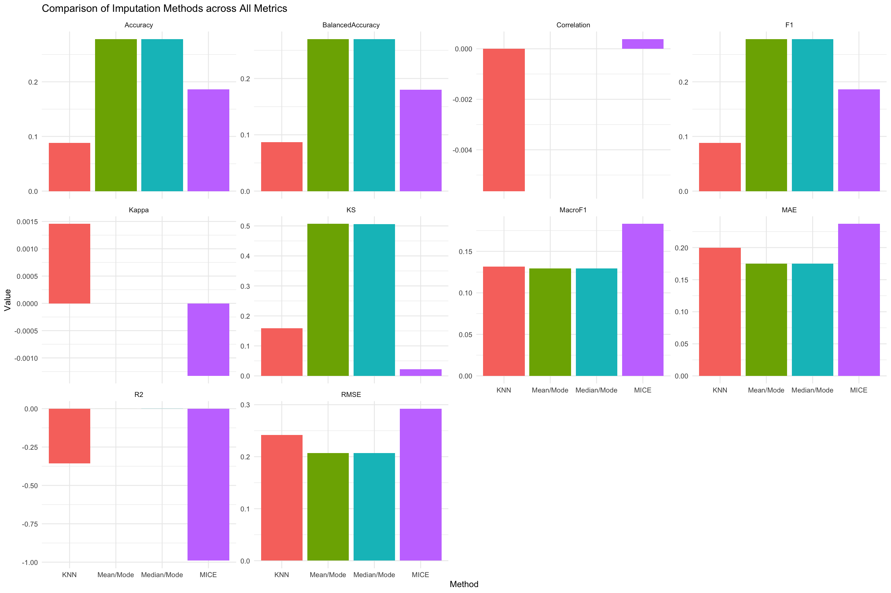

# imputetoolkit <a href="https://tanveer09.github.io/imputetoolkit/"></a>

<!-- badges: start -->

[](https://lifecycle.r-lib.org/articles/stages.html#experimental) [](https://github.com/tanveer09/imputetoolkit/blob/main/LICENSE.md) [](https://github.com/tanveer09/imputetoolkit) [](https://github.com/tanveer09/imputetoolkit) []()

<!-- badges: end -->

## Overview

**imputetoolkit** is an R package for **evaluating and benchmarking missing-data imputation techniques** using a unified **R + C++ backend**.

It automates the full workflow of **data preparation → missingness injection → imputation → metric-based evaluation → visualization**, providing both **numeric** and **categorical** assessments.

With parallel computation, C++ acceleration, and an intuitive S3 interface (`print`, `summary`, `plot`), the package allows users to **quantitatively justify imputation strategy choices**.

------------------------------------------------------------------------

## Key Features

| Category                      | Description                                                                                                                      |
|--------------------------|----------------------------------------------|
| **Imputation Methods**        | Mean/Mode (skewness-aware log transform), Median/Mode, MICE, and mixed-type KNN (parallelized)                                   |
| **Evaluation Metrics (Rcpp)** | Split into: <br>• *Numeric:* RMSE, MAE, R², Correlation, KS <br>• *Categorical:* Accuracy, Kappa, F1, MacroF1, Balanced Accuracy |
| **Parallelization**           | Multi-core KNN imputation using `FNN`, `foreach`, and `doParallel`                                                               |
| **Scaling**                   | Min-max scaling of numeric columns for fair metric comparison                                                                    |
| **Visualization**             | ggplot2-based metric and density plots (per method or all methods)                                                               |
| **Recommendation**            | Automatic “best-method” suggestions per metric type                                                                              |
| **Reproducibility**           | Deterministic pipeline with fixed seeds and consistent outputs                                                                   |

------------------------------------------------------------------------

## Package Structure

```         
## Package Structure

imputetoolkit/
├── DESCRIPTION                     # Package metadata (name, version, author, title, description, dependencies)
├── NAMESPACE                       # Auto-generated by Roxygen; lists exported/imported functions
│
├── R/                              # Core R functions
│   ├── evaluator.R                 # Main pipeline: data validation → imputation → metric evaluation (S3 methods defined here)
│   ├── api.R                       # Public-facing wrapper/helper functions (clean user interface)
│   ├── RcppExports.R               # Auto-generated bridge between R and C++ (created by Rcpp::compileAttributes())
│
├── src/                            # High-performance C++ backend
│   ├── evaluator.cpp               # Core metrics computation (numeric & categorical in one pass)
│   ├── imputer.cpp                 # Internal functions for imputation logic and handling mixed data types
│   └── RcppExports.cpp             # Auto-generated by Rcpp — connects compiled C++ to R functions
│
├── inst/extdata/                   # Example data files bundled with the package
│   ├── sample_dataset.csv          # Small mixed-type dataset (for quick testing)
│   └── synthetic_mixed_dataset.csv # Larger synthetic dataset used in vignette + examples
│
├── man/                            # Auto-generated documentation (one .Rd per exported function)
│   ├── evaluator.Rd                # Docs for main function
│   ├── plot_metrics.Rd             # Docs for visualisation helper
│   ├── suggest_best_method.Rd      # Docs for recommendation helper
│   └── ...                         # (Other .Rd files for all exported functions)
│
├── vignettes/                      # Long-form user guide in R Markdown format
│   └── imputetoolkit.Rmd           # Full walkthrough (loading data → imputation → evaluation → plots)
│
├── tests/                          # Unit testing infrastructure
│   ├── testthat.R                  # Entry point for testthat (auto-runs all test files below)
│   └── testthat/                   # Folder containing detailed test files
│       ├── test-evaluator.R        # Tests for pipeline, error handling, and reproducibility
│       ├── test-rcpp-evaluator.R   # Tests for C++ metrics (numeric/categorical accuracy)
│       └── ...                     # (Future tests for new methods or features)
│
├── README.md                       # Main package overview (installation, examples, visuals, and test plan)
├── LICENSE / LICENSE.md            # License declaration (MIT License in your case)
│
├── .Rbuildignore                   # Excludes local/non-package files from build (e.g., .git, .Rproj, docs/)
├── .gitignore                      # Git version control exclusions
│
├── imputetoolkit.Rproj             # RStudio project file (makes package development reproducible)
│
├── _pkgdown.yml                    # Configuration file for your pkgdown documentation website
├── docs/                           # Auto-generated pkgdown site (HTML pages hosted on GitHub Pages)
│   ├── index.html                  # Home page for pkgdown site
│   ├── reference/                  # Function documentation in HTML form
│   ├── articles/                   # Vignettes rendered as articles
│   └── figures/                    # Plot and logo images used in docs
│
└── pkgdown/                        # Static assets for website styling
    ├── extra.css                   # Custom CSS for theme styling
    └── favicon/                    # App icons (favicon, apple-touch-icon, etc.)
```

------------------------------------------------------------------------

## Core Functions

### `evaluator()`

Main pipeline that executes: 1. Data loading or input validation\
2. Missingness injection\
3. Imputation via all four methods\
4. Metric evaluation (numeric & categorical)\
5. Return of structured `evaluator` objects

**Returns:**

``` r
list(mean_mode, median_mode, mice, knn)
```

Each object contains:

``` r
$method
$metrics_numeric
$metrics_categorical
```

### S3 Methods

-   `print.evaluator()` – concise summary by metric type
-   `summary.evaluator()` – per-column and aggregated results
-   `print_metrics()` – combined table across all methods
-   `plot_metrics()` – ggplot visualization for any metric
-   `suggest_best_method()` – identifies top-performing methods
-   `evaluate_results()` – runs print + plot + recommendation
-   `get_eval_list()` – extracts true/imputed pairs for density plots
-   `plot_density_per_column()` / `plot_density_all()` – visualize true vs imputed distributions

------------------------------------------------------------------------

## C++ Backend (`evaluate_imputation_split.cpp`)

Efficient Rcpp backend that calculates both **numeric** and **categorical** metrics in one pass.

### Numeric metrics

| Metric      | Description                  |
|:------------|:-----------------------------|
| RMSE        | Root Mean Square Error       |
| MAE         | Mean Absolute Error          |
| R²          | Coefficient of Determination |
| Correlation | Pearson correlation          |
| KS          | Kolmogorov–Smirnov statistic |

### Categorical metrics

| Metric           | Description               |
|:-----------------|:--------------------------|
| Accuracy         | Exact match ratio         |
| Kappa            | Chance-adjusted agreement |
| F1               | Micro-F1 score            |
| MacroF1          | Mean F1 over all classes  |
| BalancedAccuracy | Mean recall per class     |

All metrics are implemented in C++ using `Rcpp`, ensuring fast and stable performance.

------------------------------------------------------------------------

## Unit Tests (`tests/testthat/`)

Comprehensive suite covering:

| Test Area             | Focus                                                    |
|--------------------------|----------------------------------------------|
| **Pipeline**          | Verifies all 4 imputation methods run successfully       |
| **S3 Methods**        | `print`, `summary`, and invisibility checks              |
| **Wrapper Functions** | `extract_metrics`, `plot_metrics`, `suggest_best_method` |
| **Error Handling**    | Invalid inputs, unsupported file formats                 |
| **Reproducibility**   | Consistent metrics with fixed seed                       |
| **Parallel KNN**      | Multi-core execution validation                          |
| **C++ Evaluator**     | Direct unit tests for numeric/categorical metrics        |

Example:

```         
[ FAIL 0 | WARN 1 | SKIP 0 | PASS 76 ]
```

------------------------------------------------------------------------

## Installation

Requires **R ≥ 4.0**, Rtools, and compilation support for Rcpp.

### Install from GitHub

``` r
install.packages("remotes")
remotes::install_github("tanveer09/imputetoolkit@main", build_vignettes = TRUE, INSTALL_opts = c("--install-tests"))
```

### Load the package

``` r
library(imputetoolkit)
```

### Browse documentation

``` r
browseVignettes("imputetoolkit")
```

------------------------------------------------------------------------

## Dependencies

Before installation, ensure the following R packages are installed:

``` r
install.packages(c(
  "Rcpp", "FNN", "mice", "ggplot2", "dplyr",
  "knitr", "rmarkdown", "testthat", "foreach", "doParallel"
))
```

------------------------------------------------------------------------

## Example Usage

### 1. Load Data

``` r
file <- system.file("extdata", "synthetic_mixed_dataset.csv", package = "imputetoolkit")
raw_data <- read.csv(file, stringsAsFactors = TRUE)
```

### 2. Run the Evaluator

``` r
res <- evaluator(data = raw_data)
```

### 3. Inspect One Method

``` r
print(res$mean_mode)
summary(res$mean_mode)
```

### 4. Compare All Methods

``` r
print_metrics(res)
plot_metrics(res, "ALL")
```

### 5. Suggest the Best Method

``` r
suggest_best_method(res, "ALL")
```

Example output:

```         
Numeric Columns:
     Best imputation method as per "RMSE, MAE, R2, KS" metric: Mean/Mode
     Best imputation method as per "Correlation" metric: MICE

Categorical Columns:
     Best imputation method as per "Kappa" metric: KNN
     Best imputation method as per "Accuracy, F1, BalancedAccuracy" metric: Mean/Mode
     Best imputation method as per "MacroF1" metric: MICE
```

------------------------------------------------------------------------

## Example Visuals

### Metric Comparison Across Methods

``` r
plot_metrics(res, "ALL")
```

{width="90%"})

### Single Metric (e.g. RMSE)

``` r
plot_metrics(res, "RMSE")
```

{width="90%"}

### Density Comparison

``` r
eval_list <- get_eval_list(res)
plot_density_per_column(eval_list, "age")
plot_density_all(eval_list)
```

{width="90%"}

------------------------------------------------------------------------

## Evaluation Metrics Summary

| Metric               | Type        | Goal | Description                        |
|:-----------------|:-----------------|:----------------:|:------------------|
| **RMSE**             | Numeric     |  ↓   | Root Mean Squared Error            |
| **MAE**              | Numeric     |  ↓   | Mean Absolute Error                |
| **R²**               | Numeric     |  ↑   | Variance explained                 |
| **Correlation**      | Numeric     |  ↑   | Pearson correlation                |
| **KS**               | Numeric     |  ↑   | Distribution similarity            |
| **Accuracy**         | Categorical |  ↑   | Exact match rate                   |
| **Kappa**            | Categorical |  ↑   | Chance-corrected agreement         |
| **F1 / MacroF1**     | Categorical |  ↑   | Balance between precision & recall |
| **BalancedAccuracy** | Categorical |  ↑   | Mean recall per class              |

------------------------------------------------------------------------

## Additional Features

-   **Split-metric evaluation:** numeric and categorical metrics handled separately.
-   **C++ acceleration:** high-performance evaluation with safe NA handling.
-   **Parallel KNN:** multi-core computation for mixed-type datasets.
-   **Skewness-aware mean imputation:** applies log + geometric mean for \|skewness\| \> 1.
-   **Reproducible pipeline:** consistent metrics across runs (`set.seed()` used).
-   **Custom plotting:** side-by-side bar charts, density overlays, and panel comparisons.

------------------------------------------------------------------------

## Documentation

-   Function references: `?evaluator`, `?plot_metrics`, `?suggest_best_method`
-   Vignette tutorial: `vignette("imputetoolkit")`
-   Online docs: [pkgdown site](https://tanveer09.github.io/imputetoolkit/)

------------------------------------------------------------------------

## Test Plan

This section provides a detailed plan for testing the **imputetoolkit** package. Follow the steps in order. Each step includes the **purpose**, **example commands**, and the **expected outcome**. This plan allows reviewers to verify both functionality and error handling.

------------------------------------------------------------------------

## 1. Environment Setup

### **Purpose:**

Set up the environment and ensure the package installs and loads correctly.

### **Steps:**

#### 1. Install `remotes` (if not already installed):

``` r
install.packages("remotes")
```

#### 2. Install the package from GitHub (recommended command):

``` r
remotes::install_github(
  "tanveer09/imputetoolkit@draft",
  build_vignettes = TRUE,
  INSTALL_opts = c("--install-tests")
)
```

> This command builds vignettes **and** installs all test files automatically. If the package was already installed, reinstall using the same command to ensure tests are available.

#### 3. Load the package:

``` r
library(imputetoolkit)
```

**Expected outcome:** Package installs and loads without errors.

#### 4. Check vignette availability:

``` r
browseVignettes("imputetoolkit")
```

**Expected outcome:** At least one vignette appears, linking to the HTML vignette documentation.

------------------------------------------------------------------------

## 2. Data Requirements

### **Purpose:**

Confirm that reviewers use a dataset suitable for imputation evaluation.

### **Requirements:**

Your dataset should:

-   Contain at least **one numeric and/or categorical variable**.
-   Include **some missing values** for imputation.
-   Have **no constant or identical columns**.
-   Avoid extremely small datasets (fewer than \~5 rows), as MICE may fail due to collinearity.

### **Example:**

``` r
filename <- system.file("extdata", "sample_dataset.csv", package = "imputetoolkit")
raw_data <- read.csv(filename, stringsAsFactors = TRUE)
head(raw_data)
```

**Expected outcome:** A dataframe similar to the example below, with some missing values.

| age | income | score | height | color | city | education   | satisfaction | purchased |
|-----|--------|-------|--------|-------|------|-------------|--------------|-----------|
| 56  | 126091 | 51.19 | 166.1  | Red   | DAL  | High School | Neutral      | Yes       |
| 46  | 129500 | 52.75 | 182.1  | Green | LA   |             |              | Yes       |

------------------------------------------------------------------------

## 3. Evaluator Pipeline

### **Purpose:**

Run the evaluator function and confirm that it detects missing values, validates inputs, and produces results.

``` r
results <- evaluator(data = raw_data)
names(results)
```

**Expected outcome:** A list with elements `"mean_mode"`, `"median_mode"`, and `"mice"`.

**Example failure case:**

-   If the dataset has **no missing values**, the function prints:

    > “No missing values detected. Please provide data with missing entries.”

-   If both `data` and `filename` are provided, message:

    > “Both data and filename provided — using data input and ignoring filename.”

------------------------------------------------------------------------

## 4. Inspect Individual Results

### **Purpose:**

Validate print and summary outputs for each imputation method.

#### 4.1 print()

``` r
print(results$mean_mode)
```

**Expected:** Displays global metrics (RMSE, MAE, R², Correlation, KS, Accuracy).

#### 4.2 summary()

``` r
summary(results$mean_mode)
```

**Expected:** Returns a per-column metrics data frame and a “GLOBAL” summary row.

------------------------------------------------------------------------

## 5. Compare Methods

### **Purpose:**

Confirm comparative visualization and tabular summaries of metrics.

#### 5.1 print_metrics()

``` r
print_metrics(results)
```

**Expected:** Table comparing all imputation methods by metric.

#### 5.2 plot_metrics()

``` r
plot_metrics(results, "R2")
```

**Expected:** Facetted bar chart comparing methods by the selected metric.

------------------------------------------------------------------------

## 6. Suggest Best Method

### **Purpose:**

Check that the helper correctly identifies the top-performing imputation method(s).

``` r
output <- suggest_best_method(results, "ALL")
```

**Expected:** Displays methods performing best for each metric (R², KS, RMSE, etc.).

------------------------------------------------------------------------

## 7. Vignette Validation

### **Purpose:**

Ensure the vignette compiles successfully and demonstrates the full workflow.

``` r
browseVignettes("imputetoolkit")
```

**Expected:** Vignette opens and runs without errors, showcasing data loading, imputation, and evaluation.

------------------------------------------------------------------------

## 8. Error Handling

### **Purpose:**

Test robustness and clarity of error messages.

``` r
# Missing arguments
try(evaluator())

# Invalid file path
try(evaluator(data = "fake.csv"))
```

**Expected outcomes:**

-   Missing arguments → “Please provide either a filename or a data.frame.”

-   Invalid file path → “File not found: fake.csv”

-   Small dataset / constant variables → “MICE imputation failed: dataset may be too small or contain collinear variables.”

------------------------------------------------------------------------

## 9. Reproducibility Check

### **Purpose:**

Verify results are consistent across runs.

``` r
res1 <- evaluator(data = raw_data)
res2 <- evaluator(data = raw_data)
identical(res1, res2)
```

**Expected outcome:** `TRUE` — confirming reproducibility.

------------------------------------------------------------------------

## 10. Run Unit Tests

### **Purpose:**

Execute all built-in unit tests to confirm functionality.

``` r
library(testthat)
test_package("imputetoolkit")
```

**Expected outcome:**

```         
[ FAIL 0 | WARN 1 | SKIP 0 | PASS 76 ]
```

------------------------------------------------------------------------

## Development Notes

-   Modular design: easy extension for new imputation algorithms (e.g. missForest, EM).
-   Full `testthat` coverage with \>50 passing tests.
-   Fully vectorized Rcpp implementation.
-   Works seamlessly with `knitr` / `rmarkdown` for reproducible reports.

------------------------------------------------------------------------

## Feedback and Contributions

Feedback, feature requests, or bug reports are welcome via the [Issues page](https://github.com/tanveer09/imputetoolkit/issues).

------------------------------------------------------------------------

## License

Released under the [MIT License](LICENSE).

------------------------------------------------------------------------

## Citation

> Singh, Tanveer. (2025). *imputetoolkit: An R Package for Evaluating Missing Data Imputation Methods.* Victoria University of Wellington.

------------------------------------------------------------------------
