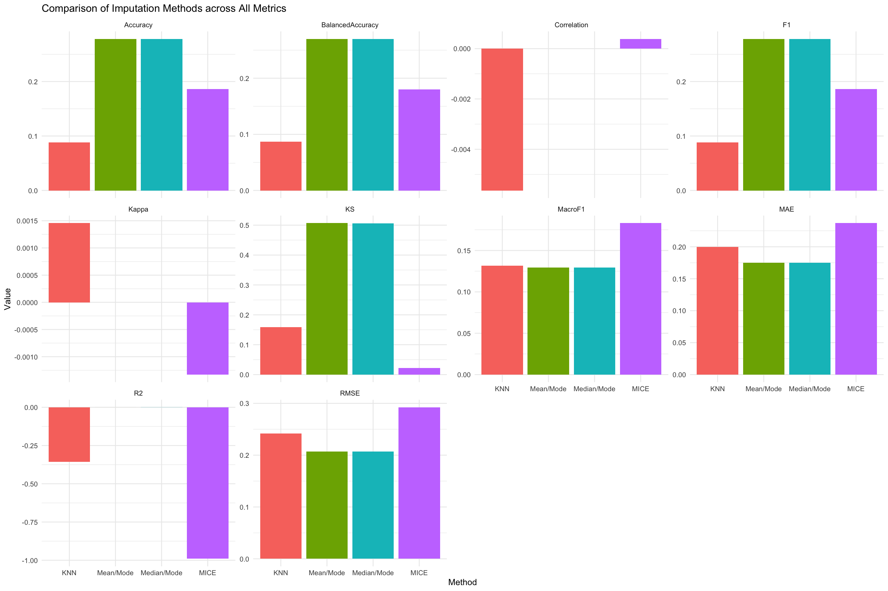
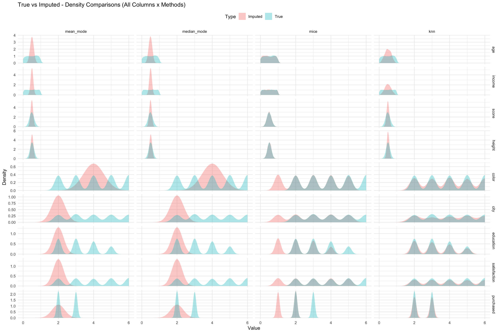

```{r, include = FALSE}
knitr::opts_chunk$set(
  collapse = TRUE,
  comment = "#>"
)
```

```{r setup, include = FALSE}
# Disable vignette examples if the sample dataset is not found
file_path <- system.file("extdata", "sample_dataset.csv", package = "imputetoolkit")
if (!nzchar(file_path) || !file.exists(file_path)) {
  warning("Sample dataset not found. Code chunks will not be evaluated.")
  knitr::opts_chunk$set(eval = FALSE)
}
```

```{r load}
library(imputetoolkit)
```

------------------------------------------------------------------------

# Introduction

Handling **missing data** remains one of the most crucial tasks in applied data science. Whether caused by *sensor failures*, *survey non-responses*, or *data-entry mistakes*, missingness can bias analyses and reduce model performance.

Simple techniques like listwise deletion often waste data. More principled strategies use **imputation** replacing missing values with reasonable estimates.

However, **no single method** performs best for all data types or distributions. The **`imputetoolkit`** package provides an **R + C++ unified framework** to **inject**, **impute**, **evaluate**, and **visualize** different imputation strategies side by side.

------------------------------------------------------------------------

# What the Package Does

`imputetoolkit` performs a full **imputation benchmarking pipeline**:

-   Controlled missingness injection

-   Multi-method imputation:

-   **Mean / Mode** (with skewness-aware log transform)

-   **Median / Mode**

-   **MICE** 

-   **KNN** (parallel mixed-type imputation using `FNN`)

    -   Split evaluation of **numeric** and **categorical** features via C++ back-end
    -   Metric computation using Rcpp for efficiency
    -   Automatic **best-method suggestions**
    -   Visual comparisons (metrics + density plots)

------------------------------------------------------------------------

# Typical Workflow

The main entry point is the **`evaluator()`** function:

``` r
res <- evaluator(filename = "path/to/data.csv")
```

Internally, this function:

1.  Loads the dataset or uses the provided data frame.

2.  Detects numeric vs categorical columns.

3.  Injects missing values under controlled proportions.

4.  Performs four imputation methods (Mean/Mode, Median/Mode, MICE, KNN).

5.  Evaluates each using:

    -   **Numeric metrics:** RMSE, MAE, R², Correlation, KS.
    -   **Categorical metrics:** Accuracy, Kappa, F1, Macro F1, Balanced Accuracy.

6.  Returns a named list of `"evaluator"` objects, one per method.

------------------------------------------------------------------------

# Example 1 - Quick Start

```{r, eval=FALSE}
# Load the built-in mixed-type dataset
file <- system.file("extdata", "synthetic_mixed_dataset.csv", package = "imputetoolkit")
raw_data <- read.csv(file, stringsAsFactors = TRUE)

# Run the full evaluator pipeline
res <- evaluator(data = raw_data)
```

### View Metrics for One Method

```{r, eval=FALSE}
print(res$mean_mode)
```

### Per-Column Summary

```{r, eval=FALSE}
summary(res$mean_mode)
```

### Compare All Methods (Table)

```{r, eval=FALSE}
print_metrics(res)
```

### Compare All Methods (Plot)

```{r, eval=FALSE, fig.width=7, fig.height=5}
plot_metrics(res, "ALL")
```

------------------------------------------------------------------------

# Example 2 - Split Evaluation: Numeric vs Categorical

Each imputation result now contains two separate metric groups:

```{r, eval=FALSE}
names(res$mean_mode)
#> [1] "method" "metrics_numeric" "metrics_categorical"
```

Example numeric-metric output (truncated):

```         
--- Numeric Metrics ---
   RMSE    MAE      R2  Correlation    KS
  0.2068  0.1750  -0.0001   0.0000   0.5068
```

Example categorical-metric output:

```         
--- Categorical Metrics ---
  Accuracy  Kappa   F1  MacroF1  BalancedAccuracy
   0.2782   0.0000  0.2782  0.1295  0.2700
```

------------------------------------------------------------------------

# Example 3 - Suggesting the Best Imputation Method

```{r, eval=FALSE}
# Single-metric suggestion
suggest_best_method(res, "RMSE")

# Aggregate suggestion across all metrics
suggest_best_method(res, "ALL")
```

Typical output:

```         
Numeric Columns:
   Best imputation method as per "RMSE, MAE, R2, KS" metric: Mean/Mode
   Best imputation method as per "Correlation" metric: MICE

Categorical Columns:
   Best imputation method as per "Kappa" metric: KNN
   Best imputation method as per "Accuracy, F1, BalancedAccuracy" metric: Mean/Mode
   Best imputation method as per "MacroF1" metric: MICE
```

------------------------------------------------------------------------

# Example 4 - Visual Comparison of Results

The following visualizations summarize and compare the imputation performance across all methods.

### Metric-Based Plots

```{r, eval=FALSE, fig.width=7, fig.height=5}
plot_metrics(res, metric = "RMSE")            # Numeric
plot_metrics(res, metric = "Accuracy")        # Categorical
```

```{r fig-metrics, fig.cap="Comparison of Imputation Methods Across All Evaluation Metrics", fig.align='center', out.width='90%', fig.width=8, fig.height=5, eval=FALSE}

plot_metrics(res, metric = "ALL")
```

{width=90%}

*Figure 1.* Comparison of four imputation methods - **KNN**, **Mean/Mode**, **Median/Mode**, and **MICE**, across both numeric and categorical evaluation metrics. Each facet represents a specific metric, with the x-axis showing the imputation methods side by side. This plot enables quick visual comparison and helps identify which method performs best overall.

------------------------------------------------------------------------

# Example 5 - Distributional Similarity via Density Plots

Distribution plots help verify whether imputed values preserve the shape of the original data.

Distribution overlap between **true** and **imputed** values can be visualized:

```{r, eval=FALSE}
eval_list <- get_eval_list(res)

# Single column
plot_density_per_column(eval_list, "age")

```

```{r fig-metrics-all, fig.cap="Comparison of Imputation Methods Across All Evaluation Metrics",fig.align='center', out.width='110%', fig.width=11, fig.height=6.5, eval=FALSE}
plot_density_all(eval_list)
```

{width=90%}

*Figure 2.* True (blue) and imputed (red) value distributions across all numeric variables and imputation methods.  
Each column represents a method and each row a variable. Greater overlap between the blue and red curves indicates closer preservation of the original data distribution.


------------------------------------------------------------------------

# Evaluation Metrics (Expanded)

| **Metric**            | **Definition / Purpose**                                 | **Better Value** |
|:---------------|:---------------------------------------|:--------------:|
| **RMSE**              | Root Mean Square Error - overall numeric deviation       |        ↓         |
| **MAE**               | Mean Absolute Error                                      |        ↓         |
| **R²**                | Proportion of variance explained                         |        ↑         |
| **Correlation**       | Pearson correlation between true & imputed values        |        ↑         |
| **KS**                | Kolmogorov–Smirnov statistic - distributional similarity |        ↑         |
| **Accuracy**          | Fraction of exact categorical matches                    |        ↑         |
| **Kappa**             | Chance-adjusted agreement statistic                      |        ↑         |
| **F1 / Macro F1**     | Harmonic mean of precision & recall / class-balanced F1  |        ↑         |
| **Balanced Accuracy** | Mean recall across classes (robust to imbalance)         |        ↑         |

------------------------------------------------------------------------

# Example 6 - Full Automated Comparison

```{r, eval=FALSE}
evaluate_results(res, metric = "ALL")
```

This wrapper prints summary tables, draws all metric plots, and automatically reports the top-performing imputation methods.

------------------------------------------------------------------------

# Behind the Scenes

### Rcpp C++ Backend

-   `evaluate_imputation_split()` computes numeric and categorical metrics in C++ for speed.
-   Numeric metrics → RMSE, MAE, R², Correlation, KS
-   Categorical metrics → Accuracy, Kappa, F1, Macro F1, Balanced Accuracy

### Parallel KNN Imputation

-   Uses `FNN::get.knnx()` and `doParallel` for mixed-type parallel processing.

### Skewness-Aware Mean Imputation

-   Applies a **log + geometric-mean correction** when absolute skewness \> 1.

### Min–Max Scaling

-   All numeric columns scaled to [0, 1] for fair cross-feature evaluation.

------------------------------------------------------------------------

# Summary

`imputetoolkit` now supports **split numeric/categorical evaluation** and **automated visualization** within one reproducible workflow.

-   Unified interface for multiple imputation strategies
-   Rcpp-accelerated metric computation
-   Parallel KNN for mixed-type data
-   Density & metric visualizations
-   Best-method recommendations by metric type

Ideal for **research**, **teaching**, and **benchmarking imputation methods**.

------------------------------------------------------------------------

# Further Reading & Citation

For reproducible examples:

``` r
vignette("imputetoolkit")
```

If you use this package, please cite:

> **Singh, Tanveer (2025).** *imputetoolkit: An R Package for Evaluating Missing Data Imputation Methods.* Victoria University of Wellington.

------------------------------------------------------------------------
